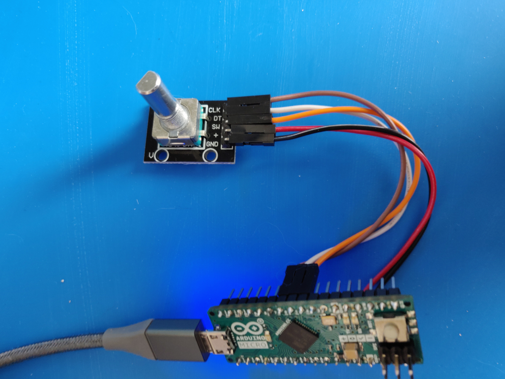
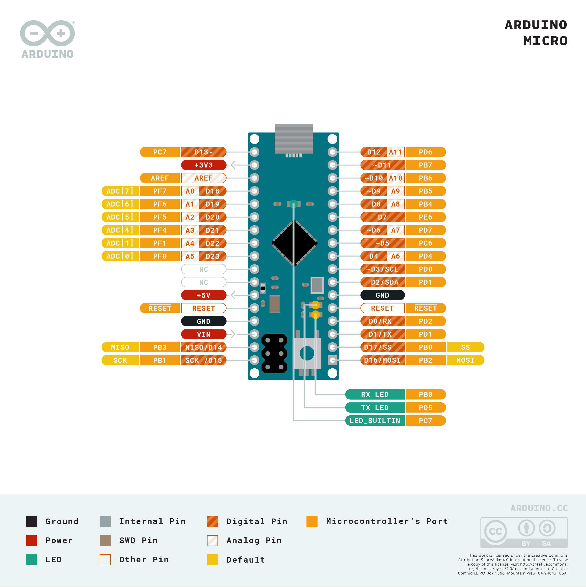

### input-volume-and-mute

A simple volume control based on a rotary encoder - turn to increase / decrease volume, and click to mute / unmute.

#### Parts
- Arduino Micro
- Rotary encoder
- Windows 10 PC

#### Arduino Libaries
- Built-in: Encoder v1.4.1 ([https://github.com/PaulStoffregen/Encoder](https://github.com/PaulStoffregen/Encoder) and 
[https://www.pjrc.com/teensy/td_libs_Encoder.html](https://www.pjrc.com/teensy/td_libs_Encoder.html))
- Built-in: Debouncer v0.1.0 ([https://github.com/hideakitai/Debouncer](https://github.com/hideakitai/Debouncer))
- Built-in: HID-Project v2.6.1 ([https://github.com/NicoHood/HID](https://github.com/NicoHood/HID))

#### Wiring
The pin-out of the encoder seems to have arbitrary labels in the form of `CLK` and `DT` - these seem to have no bearing 
on behaviour and have been ignored so far.

| Encoder              | Arduino |
|----------------------|---------|
| `SIGNAL_A` (`CLK`)   | `PIN 6` |
| `SIGNAL_B` (`DT`)    | `PIN 5` |
| `SW`                 | `PIN 4` |
| `+`                  | `5V`    |
| `GND`                | `GND`   |

---

#### Notes
This was based on combination of [https://blog.prusaprinters.org/3d-print-an-oversized-media-control-volume-knob-arduino-basics_30184/](https://blog.prusaprinters.org/3d-print-an-oversized-media-control-volume-knob-arduino-basics_30184/) (sample code [here](docs/oversized_volume_knob.ino)) 
and [https://hackaday.io/project/165285-webtuner](https://hackaday.io/project/165285-webtuner) (source code [here](https://github.com/tachiniererin/webtuner)).

The first implementation used the Prusa article approach of pins `A0`, `A1`, and `A2` - this resulted in odd behaviour 
when adjusting the volume, specifically:
- Turning the volume up worked, but the actual volume changes were poorly mapped to actual input (mild fluctations up / down)
- Turning the volume down didn't really work at all (temporary drops but then returning to the original volume)

Changing the pins to `4`, `5`, and `6` seemed to fix everything, although the Micro also needed to be disconnected and then 
reconnected to the PC after the pin update.
